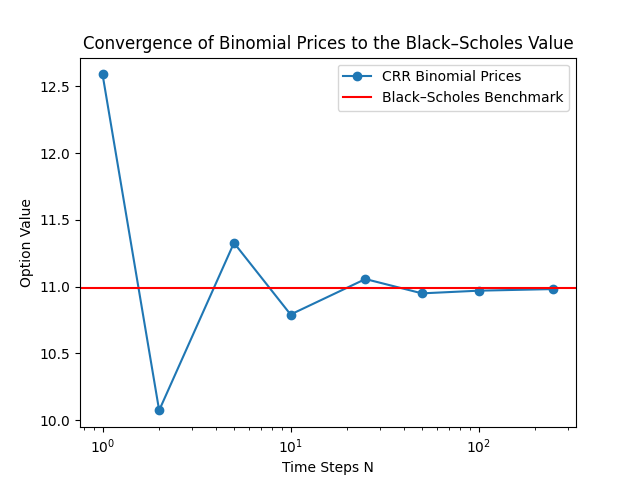
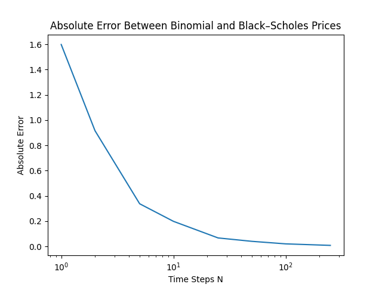

# Binomial Pricing Model: CRR Convergence to Black–Scholes

## Description
The goal of this project was to implement an N-step Cox-Ross-Rubinstein (CRR) binomial pricing model for European options and investigate numerically how the CRR binomial model converges to the Black–Scholes price as N increases.

## Features
- European call and put pricing with an N-step CRR binomial tree
- Risk-neutral backward induction
- Black–Scholes benchmark comparison
- Convergence and absolute error plots

## Theory Overview
The binomial pricing model is a discrete-time option pricing model based on portfolio replication and the law of one price. The law of one price states that if two assets or portfolios have the same payoff in every possible state at a future time T, then their values today must be equal, otherwise an arbitrage opportunity would exist. Using this idea, the model constructs a portfolio of stock and a risk-free asset that replicates the option payoff at expiration.

The binomial model assumes that the stock price has only two possible states at each time step: an up state and a down state. In the multi-period model, option values are computed using backward induction. We begin at the terminal layer using the option payoffs at expiration, then work backward through the tree until we reach the root node, which gives the option price today.

## Convergence Results
For small values of N, the binomial model produced a rough approximation of the Black–Scholes price. As N increased, the binomial prices oscillated around the Black–Scholes value but overall converged to the benchmark price. The absolute error also decreased as N increased, which provided numerical evidence of convergence.

## Plots

## Limitations
This model relies on several simplifying assumptions, including constant volatility, a constant risk-free interest rate, and no transaction costs. Although increasing the number of time steps N improves accuracy, it also increases computational cost. The Black–Scholes model is more efficient for standard European options with a closed-form solution, while binomial trees are especially useful for pricing American options because they can naturally account for early exercise.

## How to Run
1. Open `binomialmodel_convergence.py`
2. Set the model parameters in the script
3. Run the file in Python
4. View the convergence output and generated plots